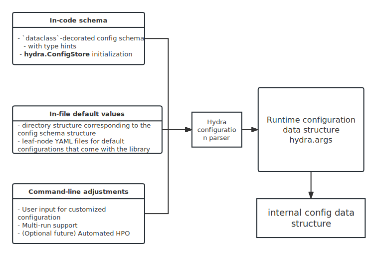

Configuration system
==============

.. _Hydra: https://hydra.cc/

Due to the high complexity in configuring quant experiments (including data, model, training, evaluation, etc.), we provide a configuration system to simplify the configuration process. The configuration system is built upon Hydra_, which provides abundant features for configuring experiments.

    The config system structure in q4l.

Structured config schema for quant experiments
--------
Previous Quant libraries such as Qlib use YAML as the config file format and builds a customized config parsing module to process these configs. However, there is a loose coupling between the config schema and its usages in the code. This makes it hard to maintain consistency between schema and actual codes. To bridge this gap, we leverage Hydra's `structural config schema <https://hydra.cc/docs/tutorials/structured_config/schema/>`_ to explicitly define config schema, including the names of config fields and their data types. In this way type checking can be performed on the config file, and the IDE can provide auto-completion and type hints for config fields, thus improving the development experience and code quality.

Specifically, the overall config schema is defined in `q4l/config/__init__.py`, with example structures shown below:

.. code-block:: python

    @dataclass
    class ModuleConfig:
        name: str
        module_path: str
        kwargs: tp.Dict

    @dataclass
    class DataConfig:  # Data loading is essentially an ETL process
        loader: LoaderConfig  # Specifies "external_storage" => "in-memory raw data"  
        preprocessor: PreprocessorConfig  # Specifies "in-memory raw data" => "in-memory pre-processed data"
        sampler: SamplerConfig  # Specifies "in-memory pre-processed data" => "in-memory sampled data"

        # Some misc configs
        pool: str  # Stock/Instrument universe (e.g. "csi500", "hsi", "sp500", etc.)
        region: str  # Region (e.g. "cn", "hk", "us", etc.)
        # Shared memory configs
        use_shm: bool  # Whether to use shared memory (for memory saving in parallel computing)
        shm_name: str  # Name of the shared memory file in /dev/shm
        # Disk cache config
        fetch_orig: bool  # Whether to fetch original data instead of disk cache (e.g. for debugging)
        benchmark: str  # Backtest benchmark ticker code (e.g. "000300.SH", "^GSPC", etc.)
        graph: tp.Dict  # Graph data config

The `structural` feature of config components shows that the config schema can be defined in a hierarchical way. For example, the `DataConfig` is composed of three sub-configs, namely `LoaderConfig`, `PreprocessorConfig` and `SamplerConfig`. Each of these sub-configs can be further decomposed into more sub-configs.

Keeping some flexibility in the config schema
************
Strong type check will be performed during code execution with our given config schema, so in common cases the config schema should be strictly followed. However, in some cases we may want to keep some flexibility in the config schema, for example, we may want to add some new config fields in the config file without modifying the config schema. To achieve this, we can specify a certain field as `typing.Dict` so that it can be used to store arbitrary key-value pairs. For example, in the `DataConfig` above, the `kwargs` field of `ModuleConfig` is defined as `tp.Dict`, which means that we can add arbitrary key-value pairs in the config file. This is useful when we want to add some new config fields without modifying the config schema.

Config group and default and built-in config
--------
Since config is organized in a hierarchical way, we can group related configs into a config group. For example, we can group all configs related to data loading into a config group named `data`. In this way, we can use :code:`++experiment/data=[data_config_group]` to specify the config group to use. For more details, please refer to `Hydra documentation <https://hydra.cc/docs/tutorials/basic/your_first_app/config_groups/>`_.

Command-line interface
--------
Since the config system is built upon Hydra, it has all the powerfull CLI features Hydra provides, including `multirun <https://hydra.cc/docs/tutorials/basic/running_your_app/multi-run/>`_, `override syntax <https://hydra.cc/docs/advanced/override_grammar/basic/>`_, etc. Please refer to `Hydra documentation <https://hydra.cc/docs/intro>`_ for more details.

Using config object in code
--------
To access hydra config, just decorate your main function with `hydra's decorator`. For example, the code below is a simple experiment launching function:

.. code-block:: python

    @hydra.main(config_path="../config", config_name="prod", version_base=None)
    def main(config: GlobalConfig):
        timestamp = datetime.now().strftime("%Y-%m-%dT%H-%M-%S")
        config.job.misc.timestamp = timestamp
        exp_fn = partial(rolling_fn)
        RepeatExpManager(
            config=config, exp_fn=exp_fn
        ).run()  # Launch the experiment

Please refer to the `Hydra documentation <https://hydra.cc/docs/intro>`_ for more details and advanced features.