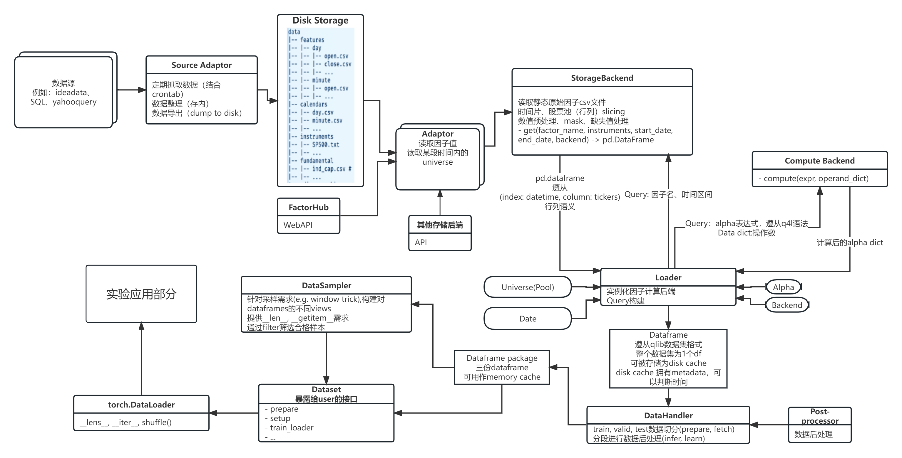

Loading and processing data
================

Data loading and processing is very important in quant research. Here we introduce the design of q4l's data module to support flexible data loading and processing.

    The data pipeline in q4l.

Generally speaking, the data pipeline of q4l can be listed as the following steps:

1. Load raw data from storage (disk/database/etc.) using :code:`Storage Backend`.
2. Compute alpha factors using these raw data and the given formulaic alpha expressions (specified in config) using :code:`Compute Backend`.
3. Pre-process the data and organize them into dataframes.
4. Sample from the dataframe for model training.

Data storage protocol
---------------------
Currently we largely follow the data storage protocol of `qlib <https://qlib.readthedocs.io/en/latest/component/data.html#qlib-format-dataset>`_, except that we store each individual meta factor as a single csv file, instead of one file per stock(instrument).

Of course, the csv-style data storage only works for `FileSystemBackend`, and we will support more data storage protocols/formats in the future.

Data handling
-------------

Storage backend
**************
The job of storage backend is to get factor dataframes based on given feature name and date range.

Compute backend
***************
The compute backend serves as an alpha expression compute engine. It provides 2 functionalities:
1. Parse the alpha expression and generate a compute graph (syntax tree) using Python's builtin `ast <https://docs.python.org/3/library/ast.html>`_ module. This means that the alpha expressions should be valid Python expressions.
2. Evaluate the compute graph using the given dataframes, using the operators implemented in the specific backends. This is achieved by modifying the backend class's :code:`__getattr__` method to return the corresponding operator. If customized operators are needed for a specific backend, it can be implemented as a method of the backend class.

An example config for computing formulaic alpha looks like this:

.. code-block:: yaml

  loader:
    alpha:
      c2c:
        name: c2c
        compute_backend: myhxdf
        expressions:
          c2c_1d: '{disk:close} / delay({disk:close}, 1) - 1'
    backend:
      compute:
        myhxdf:
          name: MyHXDFComputeBackend
          module_path: q4l.data.backend.compute
          kwargs: {}
      storage:
        disk:
          name: FileSystemBackend
          module_path: q4l.data.backend.storage
          kwargs:
            frequency: day
            root_dir: ${job.machine.data_root}/${experiment.data.region}

This config specifies alpha as 1-day close-to-close rate, with local storage :code:`FileSystemBackend` and :code:`MyHXDFComputeBackend` (similar to pandas, but uses `hxdf <https://link.springer.com/article/10.1007/s11390-023-2879-5>`_) as compute backend. **{disk:close}** means the factor name is **close** and the factor should be loaded by the **disk** storage backend. This syntax is specifically designed in `q4l`. **delay** is an operator in :code:`MyHXDFComputeBackend`. 

Data pre-processing
-------------------
After the data handler loads and computes data from the above steps, we will obtain a big dataframe that looks similar to that in qlib. And the pre-processing step follows the same convention, so we will refer interested readers to qlib's `Data Loader <https://qlib.readthedocs.io/en/latest/component/data.html#id7>`_ and `Data Handler <https://qlib.readthedocs.io/en/latest/component/data.html#id7>`_ for this part.

Data sampling
-------------------
Since quant data usually relates to time series, before sampling we need to apply `rolling window` to the data. For efficiency consideration, this step is achieved via `numpy's window trick <https://numpy.org/devdocs/reference/generated/numpy.lib.stride_tricks.sliding_window_view.html>`_, which returns new views to the original data instead of copying them.

Support for graph-structured data
-----------------------
Besides the commonly used time-series data, we also support graph-structured data to support GNN training/inference. Currently it is implemented in `q4l/model/zoo/spatial/fundamental/base.py` using `dgl <http://dgl.ai/>`_, and we are working on a more general graph data handler to support more graph data formats.
