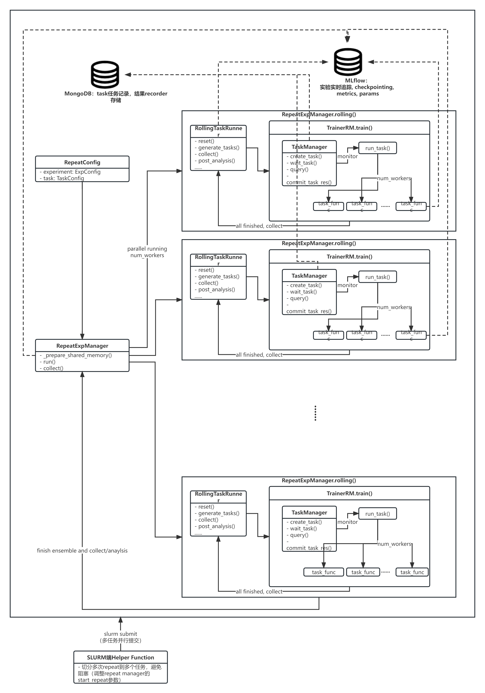

Experiment management
=====================

A quant experiment is essentially "data + model" (as we have omitted the evaluation part which largely relies on qlib, and has many other implementations). Besides, we also support repeat (ensemble) and rolling (forward) retraining which are common principles in quant research due to the inherent non-stationarity and noisiness of financial markets.

In this section, we will introduce how to manage experiments in qlib.

   Experiment management